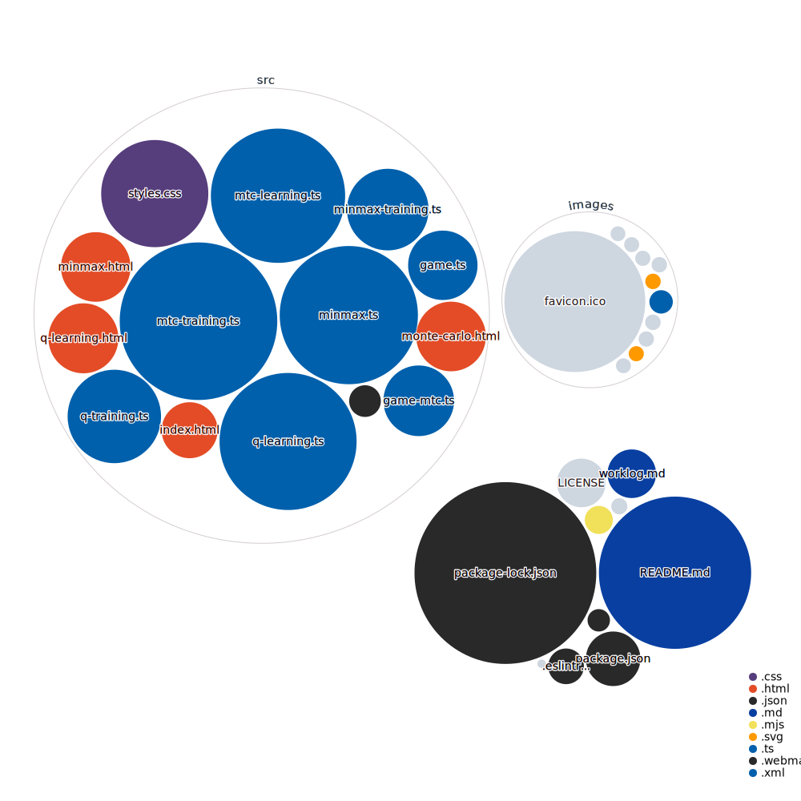

<!-- PROJECT SHIELDS -->

[![Contributors][contributors-shield]][contributors-url]
[![Forks][forks-shield]][forks-url]
[![Stargazers][stars-shield]][stars-url]
[![Issues][issues-shield]][issues-url]
[![repo-size][repo-size-shield]][repo-size-url]
[![license][license-shield]][license-url]

<!-- PROJECT LOGO -->
<br />
<div align="center">

  <h3 align="center">Reinforcement Learning Tic Tac Toe</h3>

   <a href="https://tttoe.surge.sh/">
      
   </a>

  <p align="center">
    Reinforcement Learning to beat Tic Tac Toe on the Browser
    <br />
    <a href="https://tttoe.surge.sh/"><strong>See live »</strong></a>
    <br />
    <br />
    <a href="https://github.com/hirako2000/tttow-reinforcement-learning/issues">Report Bug</a>
    ::
    <a href="https://github.com/hirako2000/tttow-reinforcement-learning/issues">Request Feature</a>
  </p>
</div>

<p align="center">
OK, DOkey
</p>

<details>
  <summary>Table of Contents</summary>
      <ol>
         <li>
         <a href="#about">About</a>
         <ul>
            <li><a href="#built-with">Built With</a></li>
         </ul>
         </li>
         <li>
            <a href="#getting-started">Getting Started</a>
            <ul>
                <li><a href="#prerequisites">Prerequisites</a></li>
                <li><a href="#repo">Repo</a></li>
                <li><a href="#develop">Develop</a></li>
                <li><a href="#build">Build</a></li>
                <li><a href="#deploy">deploy</a></li>
            </ul>
         </li>
         <li><a href="#codebase">Codebase</a></li>
         <li><a href="#roadmap">Roadmap</a></li>
         <li><a href="#contributing">Contributing</a></li>
         <li><a href="#license">License</a></li>
         <li><a href="#acknowledgments">Acknowledgments</a></li>
      </ol>
</details>

<hr/>

**TL;DR**

## 🛠 Installation & Set Up

1. Install the Gatsby CLI

   ```sh
   npm install -g gatsby-cli
   ```

2. Install and use the correct version of Node using [nvm](https://github.com/nvm-sh/nvm)

   ```sh
   nvm install
   ```

3. Install dependencies

   ```sh
   npm install
   ```

4. Start the development server

   ```sh
   npm start
   ```

## 🚀 Building and Running for Production

1. Generate a full static production build

   ```sh
   npm run build
   ```

<hr/>

## About

Reinforcement learning in the browser. Without libraries (for now).

Yes of course I could use Python. But does it run on the browser?

<div align="center">

   <a href="https://tttoe.surge.sh/">
      
   </a>
</div>

Do I know what I'm doing? Not quite.

<a href="https://tttoe.surge.sh/minmax.html">MinMax algo</a>
<a href="https://tttoe.surge.sh/q-learning.html">Q-Learning algo</a>


<p align="right">(<a href="#readme-top">back to top</a>)</p>

### Built With

- [node.js](https://nodejs.org/) - of course
- [typescript](https://www.typescriptlang.org/) - because scripting is great but it's good to have types
- [parceljs](https://parceljs.org/) - I would have gone with nothing to bundle, but it speed things up to just use a good bundler with Hot Module Reloading during dev.

### Also using

- [eslint](https://eslint.org/) - to check TS isn't too wonky
- [prettier](https://prettier.io/) - that keeps code well formatted

<hr/>

## Getting Started

### Prerequisites

- you need [Git](https://git-scm.com/)
- and [nodejs](https://nodejs.org/) of course

### Repo

```bash
$ git clone https://github.com/hirako2000/tttow-reinforcement-learning.git
```

Navigate to the repo root's folder then install dependencies

```bash
$ cd ./tttow-reinforcement-learning && npm install
```

### Develop

```bash
$ npm run dev # or npm run start
```

### Build

This command will build everything for production deployment:

```bash
$ npm run build
```

It generates the files for the entire page.

### Deploy

To host the assets, the build placed them all into the `public` folder. this deploy script uploads them 'somewhere':

```bash
$ npm run deploy
```

_you may want to tweak that script in package.json, search for deploy._
_There are free hosting services out there, e.g [surge.sh](https://surge.sh), or [Netlify](https://www.netlify.com/)._

<p align="right">(<a href="#readme-top">back to top</a>)</p>

### Customize

- There is some html and styles.css, but many node elements gets created via JavaScript
- There is typically a trainner file. Game logic is kept in a separate file. And of course the index
- Since training isn't instant, it's always processed via a web worker, to not hold the main thread
- Messages are sent from the worker to get updates (tyically to refresh)


<hr/>

## Codebase



## Roadmap

- [x] Tic Tac Toe game logic
- [x] Human vs Human
- [x] Minmax training
- [x] Human vs AI
- [x] Unbeatable minmax model
- [x] Unbeatable Q-learning
- [x] Render training metadata
- [x] Render AI decision making
- [x] better layout
- [ ] Make q learning actually work!
- [ ] Monte Carlo
- [ ] Genetic algorithm 
- [ ] superb layout
- [ ] amazing layout
- [ ] Measure AI performance
- [ ] more to come I guess

<hr/>

## Contributing

Contributions are what make the open source community such an amazing place to learn, inspire, and create. Any contributions you make are **greatly appreciated**.

If you have a suggestion that would make this better, please fork the repo and create a pull request. You can also simply open an issue with the tag "enhancement".
Don't forget to give the project a star! Thanks again!

1. fork the Project
2. create your Feature Branch (`git checkout -b feature/some-feature`)
3. commit your Changes (`git commit -m 'Add some feature'`)
4. push to the Branch (`git push origin feature/some-feature`)
5. open a Pull Request

<hr/>

## License

[![license][license-shield]][license-url]

This work is licensed under the [MIT license][license-url].

You may use and remix this content, but not for commercial use. Such as selling the templates and stuff like that.

[license-url]: https://opensource.org/license/mit
[cc-by-nc-sa-shield]: hhttps://img.shields.io/github/license/hirako2000/tttow-reinforcement-learning?style=for-the-badge

If you too produce work and publish it out there, it's clearer to choose a [license](https://choosealicense.com).

<p align="right">(<a href="#readme-top">back to top</a>)</p>

<hr/>

## Acknowledgments

Richard S. Sutton and Andrew G. Barto for their great book: **Reinforcement Learning** _An introduction_

If you decide to re-use this repo, go ahead. No need to credit or link back to this repo/site. Although it would be much appreciated.
**Don't re-republish the UI and logic pretty much as is though**, it is lame, and shameless.
Tweak the look and feel, custom the training, make it better, make it your own. Make it so that I wouldn't come across your stuff and think that it is mine. So that nobody comes across your stuff and somehow finds out it's a louzy copy of someone else lacking added value and personalisation.

[contributors-shield]: https://img.shields.io/github/contributors/hirako2000/tttow-reinforcement-learning.svg?style=for-the-badge
[contributors-url]: https://github.com/hirako2000/tttow-reinforcement-learning/graphs/contributors
[forks-shield]: https://img.shields.io/github/forks/hirako2000/tttow-reinforcement-learning.svg?style=for-the-badge
[forks-url]: https://github.com/hirako2000/tttow-reinforcement-learning/network/members
[stars-shield]: https://img.shields.io/github/stars/hirako2000/tttow-reinforcement-learning.svg?style=for-the-badge
[stars-url]: https://github.com/hirako2000/tttow-reinforcement-learning/stargazers
[issues-shield]: https://img.shields.io/github/issues/hirako2000/tttow-reinforcement-learning.svg?style=for-the-badge
[issues-url]: https://github.com/hirako2000/tttow-reinforcement-learning/issues
[license-shield]: https://img.shields.io/github/license/hirako2000/tttow-reinforcement-learning.svg?style=for-the-badge
[license-url]: https://github.com/hirako2000/tttow-reinforcement-learning/blob/main/LICENSE
[score-shield]: https://img.shields.io/ossf-scorecard/github.com/hirako2000/tttow-reinforcement-learning?style=for-the-badge
[repo-size-shield]: https://img.shields.io/github/repo-size/hirako2000/tttow-reinforcement-learning?style=for-the-badge
[repo-size-url]: https://github.com/hirako2000/tttow-reinforcement-learning/archive/refs/heads/main.zip
[product-screenshot]: images/tttow-reinforcement-learning-desktop.png
